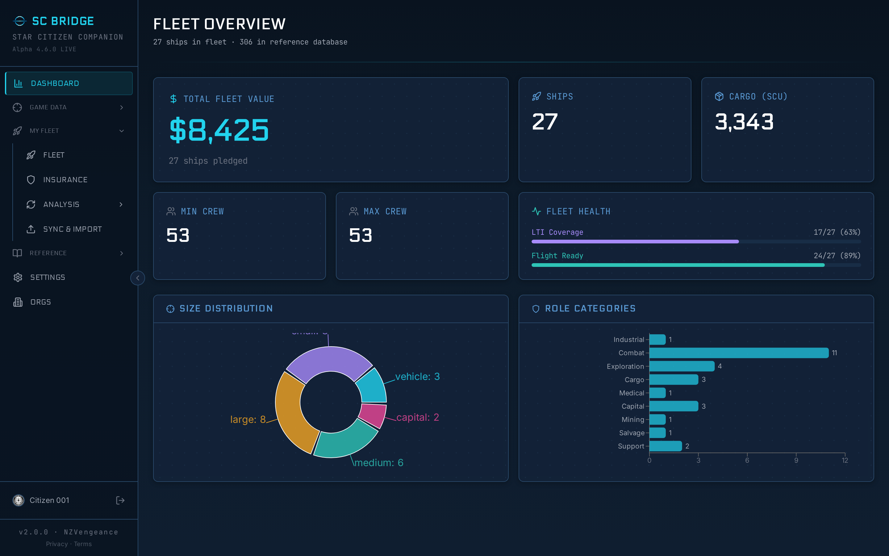
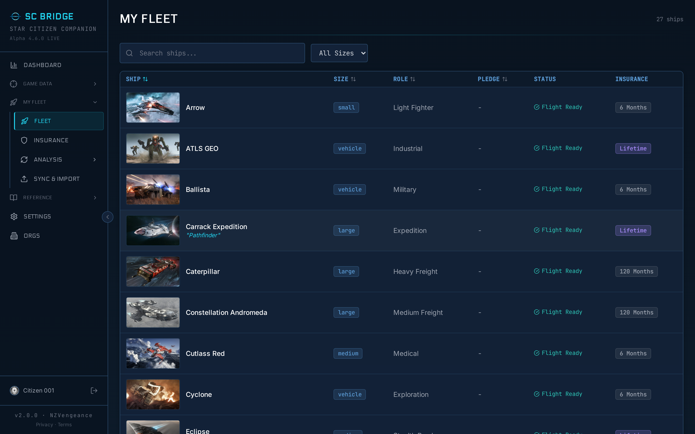
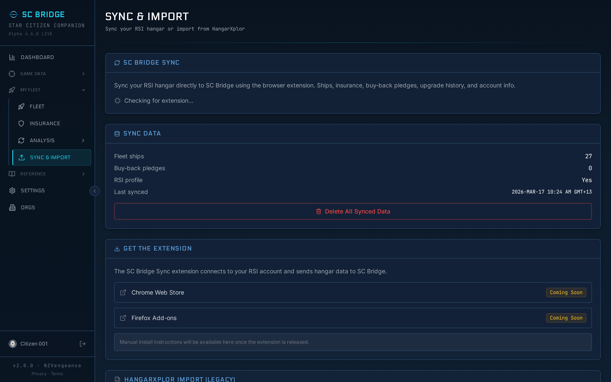
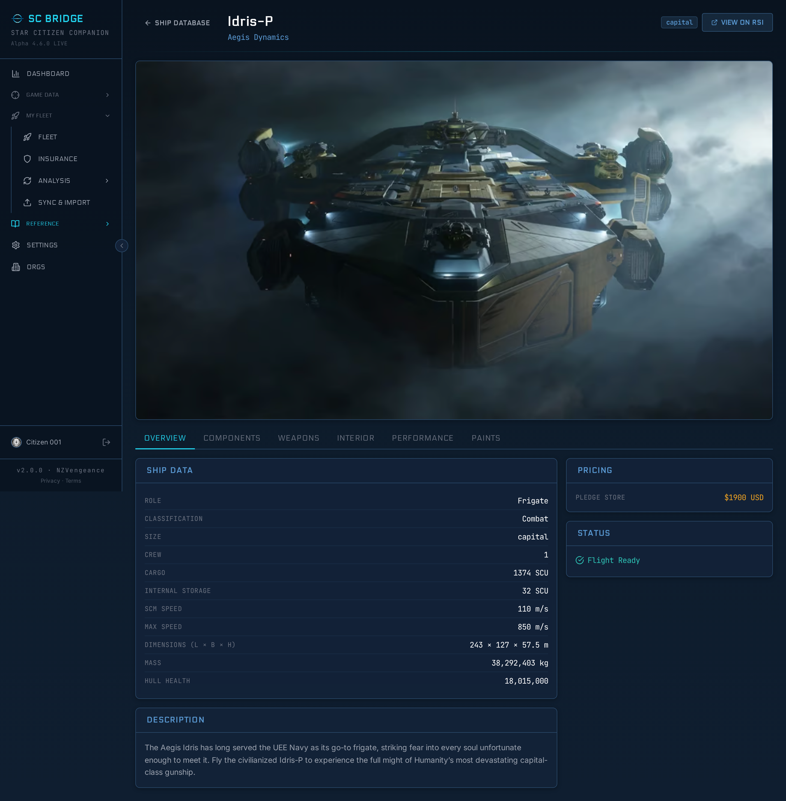
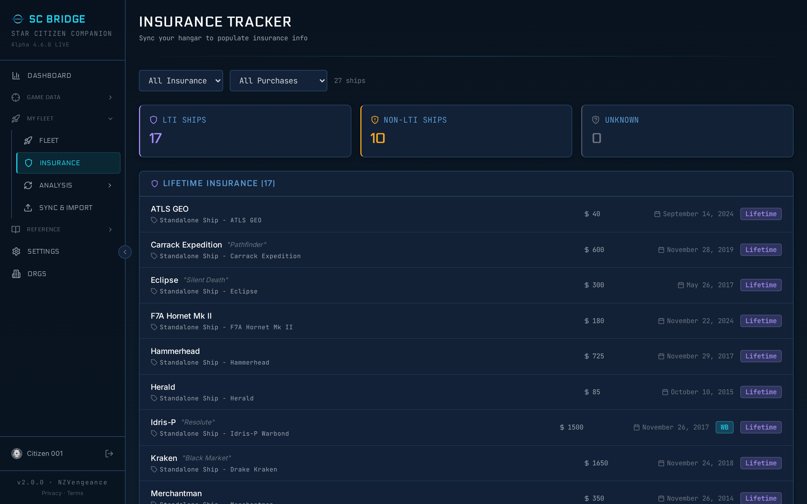
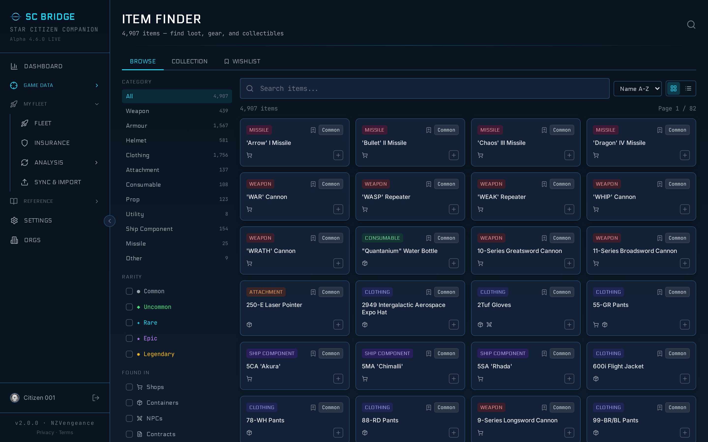
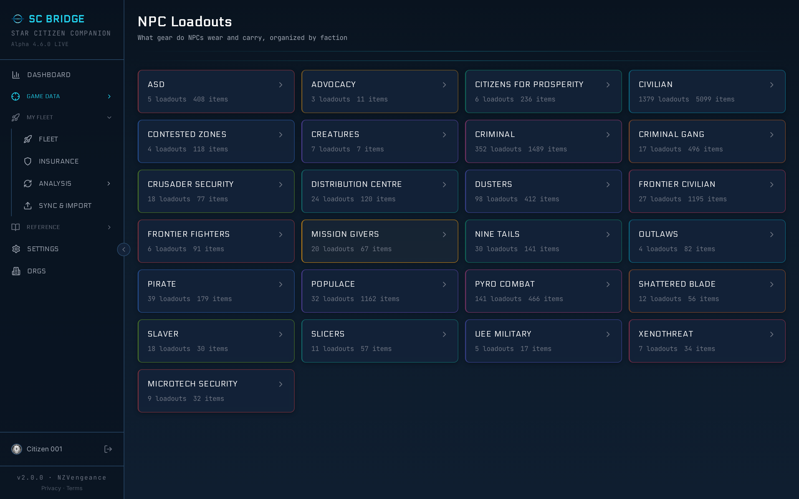

# SC Bridge

A Star Citizen companion web app — fleet management, hangar sync, ship database, insurance tracking, loot data, and game reference. Live at [scbridge.app](https://scbridge.app).



## Features

### Fleet Management
Track your ships, custom names, insurance types, pledge costs, and production status. Synced directly from your RSI hangar.



### Hangar Sync
Sync your RSI hangar to SC Bridge with the [SC Bridge Sync](https://github.com/SC-Bridge/sc-bridge-sync) browser extension. Ships, insurance, buy-back pledges, upgrade history, and account info — collected automatically from the RSI website.



### Ship Database
Browse all Star Citizen ships with specs, components, weapons, paints, loadouts, and performance data.



### Insurance Tracker
Dashboard showing LTI vs timed insurance coverage, pledge history, and at-risk ships.



### Loot Database
Browse in-game loot with location data, rarity, and NPC drop sources.



### NPC Loadouts
What gear NPCs wear and carry, organized by faction.



### More
- **Fleet Analysis** — AI-powered gap detection, redundancy analysis, role distribution
- **Org Support** — org fleets with visibility controls (public / org / officers / private)
- **Game Reference** — shops, trade commodities, factions, laws, reputation, careers, missions

## Tech Stack

- **Backend**: Cloudflare Worker (TypeScript), [Hono](https://hono.dev) framework
- **Database**: Cloudflare D1 (SQLite), 121 migrations
- **Auth**: [Better Auth](https://www.better-auth.com) with email, Google, Discord, GitHub, Twitch
- **Frontend**: React SPA, [Vite](https://vitejs.dev), Tailwind CSS, Recharts
- **Extension**: WXT browser extension (Chrome + Firefox) for RSI hangar sync
- **Caching**: Cloudflare Workers KV (25 game-data endpoints)
- **Storage**: Cloudflare R2 (avatars), Workers Assets (SPA)
- **CI/CD**: GitHub Actions → `wrangler deploy` on push to `main` or `staging`

## Data Sources

| Source | What | When |
|--------|------|------|
| RSI hangar (via extension) | Fleet, insurance, pledges, buy-back, upgrades, account | User-triggered sync |
| HangarXplor JSON | Fleet import (legacy fallback) | User-triggered upload |
| RSI GraphQL API | Ship + paint images | Nightly cron (3:45 AM) |
| Fleetyards API | Production status sync | Nightly cron (4:00 AM) |
| DataCore p4k extraction | Components, FPS gear, loot map, NPC loadouts | Manual extraction scripts |

## Development

### Prerequisites

- Node.js 22+
- Wrangler CLI (`npm install -g wrangler`)
- Cloudflare account (for D1, R2, KV)

### Local Dev

```bash
npm install
npm run dev          # Vite dev server + Worker via miniflare
```

### Build & Deploy

```bash
npm run build        # Build frontend + bundle Worker
npm run deploy       # wrangler deploy (requires CLOUDFLARE_API_TOKEN)
```

Push to `main` deploys to production. Push to `staging` deploys to staging.

### Database Migrations

```bash
source ~/.secrets
npx wrangler d1 migrations apply sc-companion --remote
```

Migrations in `src/db/migrations/`. Conventions in `src/db/CONVENTIONS.md`.

## Environments

| | Production | Staging |
|-|-----------|---------|
| **URL** | scbridge.app | staging.scbridge.app |
| **Worker** | sc-bridge | sc-bridge-staging |
| **D1** | sc-companion | sc-companion-staging |
| **Deploy** | push to `main` | push to `staging` |

## License

MIT
